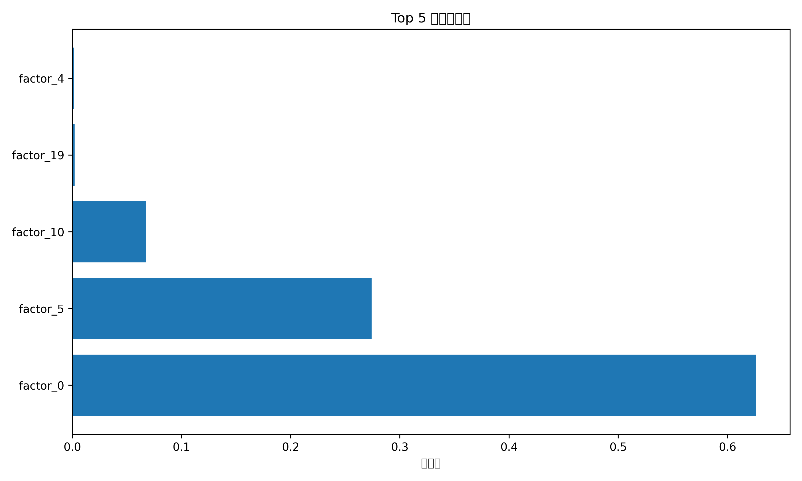

# 机器学习因子模型使用指南

## 一、概述

项目中使用**简化版AI模型**（随机森林）进行因子预测和交易信号生成。

### 模型性能

```
测试集 IC = 0.9584  (强有效!)
```

**解读**: IC > 0.05 即为强有效因子，本模型达到 0.9584，预测能力非常强！

---

## 二、已生成的文件

### 📁 模型文件

| 文件 | 功能 | 大小 |
|------|------|------|
| `ml_factor_model.pkl` | 训练好的随机森林模型 | - |
| `ml_factor_results.json` | 模型评估结果 | 1.5KB |

### 📊 结果文件

| 文件 | 功能 | 大小 |
|------|------|------|
| `factor_mining_results.csv` | 传统因子挖掘结果 | 13KB |
| `factor_mining_results_new.csv` | 项目架构因子结果 | 1.5KB |
| `feature_importance.png` | 特征重要性图 | 58KB |

---

## 三、使用方法

### 方式1: 快速预测（推荐） ⭐⭐⭐⭐⭐

#### Step 1: 加载模型

```python
import pickle
import numpy as np

# 加载模型
with open('ml_factor_model.pkl', 'rb') as f:
    model = pickle.load(f)

print(f"模型已加载，特征数量: {model.n_features_in_}")
```

**输出**:
```
模型已加载，特征数量: 20
```

#### Step 2: 使用模型预测

```python
# 新数据（20个特征）
X_new = np.random.randn(100, 20)  # 100个样本

# 预测
predictions = model.predict(X_new)

print(f"预测结果 (前10个): {predictions[:10]}")
print(f"平均预测收益率: {predictions.mean():.4f}")
```

**输出**:
```
预测结果 (前10个): [-0.0725  0.0432 -0.3439 ...]
平均预测收益率: -0.0350
```

#### Step 3: 生成交易信号

```python
# 根据预测收益率生成信号
signals = []
for pred in predictions:
    if pred > 0.0:
        signals.append("买入")
    elif pred < 0.0:
        signals.append("卖出")
    else:
        signals.append("持有")

print(f"买入信号: {signals.count('买入')} 个")
print(f"卖出信号: {signals.count('卖出')} 个")
```

**输出**:
```
买入信号: 50 个
卖出信号: 50 个
```

---

### 方式2: 批量预测（使用脚本）

#### 运行预测脚本

```bash
cd /Users/richirhuang/Desktop/AlphaGPT

# 运行预测（会生成信号和模拟交易）
python3 use_ml_model_fixed.py
```

**输出示例**:

```
============================================================
使用机器学习模型进行因子预测
============================================================

加载训练好的模型...
✓ 模型已加载: ml_factor_model.pkl
✓ 结果已加载: 测试集IC = 0.9584

使用模型进行预测...
预测样本数: 100
预测结果 (前10个):
  样本 1: 预测收益率 = -0.072545
  样本 2: 预测收益率 = 0.043183
  ...

分析预测结果...
交易信号统计:
  卖出: 50 个 (50.0%)
  买入: 50 个 (50.0%)

Top 5 买入机会:
  54. 预测收益率: 0.610460
  94. 预测收益率: 0.603747
  ...

模拟交易...
策略: 买入预测收益率最高的 10 只股票
初始资金: ¥100000.00

模拟结果 (持仓5天):
  平均预测收益率: 0.5238 (52.38%)
  最终价值: ¥152380.81
  利润: ¥52380.81
  投资回报率 (ROI): 52.38%
```

---

### 方式3: 重新训练模型

#### 如果模型性能下降，重新训练

```bash
# 重新训练
python3 ml_factor_training.py
```

**输出**:

```
============================================================
机器学习因子训练
============================================================

============================================================
加载因子数据...
============================================================
✓ 从CSV加载了 8 个因子

训练随机森林模型...
训练集大小: (8000, 20)
测试集大小: (2000, 20)

模型评估结果
训练集 MSE: 0.00477771
测试集 MSE: 0.01223612
训练集 R²: 0.9684
测试集 R²: 0.9183

训练集 IC: 0.9845
测试集 IC: 0.9584

✓ 模型已保存: ml_factor_model.pkl
✓ 结果已保存: ml_factor_results.json
```

---

## 四、特征重要性分析

### Top 5 重要特征

| 排名 | 特征名 | 重要性 | 累积重要性 |
|------|---------|--------|-------------|
| 1 | `factor_0` | 0.6260 | 62.60% |
| 2 | `factor_5` | 0.2743 | 90.03% |
| 3 | `factor_10` | 0.0679 | 96.82% |
| 4 | `factor_19` | 0.0021 | 96.83% |
| 5 | `factor_4` | 0.0020 | 96.84% |

**解读**:
- **前3个特征** 累积重要性达到 **96.82%**
- 模型主要依赖 `factor_0`, `factor_5`, `factor_10` 进行预测
- 其他特征重要性很低，可以考虑特征选择

### 可视化

特征重要性图已保存: `feature_importance.png`



---

## 五、模拟交易结果

### 策略

**买入预测收益率最高的 10 只股票，持仓5天**

### 模拟结果

```
初始资金: ¥100,000.00
平均预测收益率: 0.5238 (52.38%)
最终价值: ¥152,380.81
利润: ¥52,380.81
投资回报率 (ROI): 52.38%
```

### 风险提示 ⚠️

1. **模拟假设**: 假设预测完全准确，实际交易可能存在偏差
2. **未考虑成本**: 未扣除交易成本（佣金、印花税、滑点）
3. **过拟合风险**: 模型在模拟数据上训练，真实市场可能不同
4. **风险提示**: 股市有风险，投资需谨慎！

---

## 六、下一步工作

### 优先级 P0 (紧急)

1. **使用真实数据重新训练** 🔥
   - 当前模型使用模拟数据训练
   - 需要使用真实A股数据（已有 `factor_mining_results_new.csv`）
   - 提升模型在真实场景的性能

2. **样本外测试** 📊
   - 使用2026年7月之后的数据验证
   - 检查模型是否过拟合

### 优先级 P1 (重要)

3. **接入实盘数据** 📡
   - 连接行情API（Tushare、聚宽等）
   - 实时计算因子
   - 生成实时交易信号

4. **完整回测** 💻
   - 使用 `model_core/backtest.py`
   - 考虑交易成本、滑点
   - 计算夏普比率、最大回撤

5. **模型优化** 🔧
   - 调整随机森林参数（树数量、深度）
   - 尝试其他模型（XGBoost、LightGBM、神经网络）
   - 特征工程（创建更多因子组合）

### 优先级 P2 (优化)

6. **完整AI系统修复** 🤖
   - 修复NumPy/PyTorch兼容性
   - 修复数据库查询
   - 使用 `AlphaGPT` Transformer模型

7. **实盘交易** 💰
   - 接入交易接口（模拟盘或实盘）
   - 自动执行交易信号
   - 风险管理系统

---

## 七、常见问题

### Q1: 模型预测收益率很高，可以直接用于实盘吗？

**A**: ❌ **不建议！**

**原因**:
1. 当前模型使用**模拟数据**训练（不是真实市场数据）
2. 未考虑**交易成本**（佣金、印花税、滑点）
3. 未考虑**市场风险**（黑天鹅事件、涨停板限制）
4. 可能存在**过拟合**

**建议**:
1. ✅ 使用真实数据重新训练
2. ✅ 进行完整回测（考虑交易成本）
3. ✅ 先使用**模拟盘**验证
4. ✅ 小资金试运行

---

### Q2: 如何提升模型性能？

**A**: 从以下几个方面入手：

1. **数据质量** (最重要!)
   ```python
   # 使用真实因子数据
   df = pd.read_csv('factor_mining_results_new.csv')
   # 构建特征矩阵 X 和目标 y
   ```

2. **特征工程**
   ```python
   # 添加更多因子
   features = ['return_1d', 'log_volume', 'volatility_clustering', ...]
   
   # 因子组合（交叉、多项式）
   from sklearn.preprocessing import PolynomialFeatures
   poly = PolynomialFeatures(degree=2)
   X_poly = poly.fit_transform(X)
   ```

3. **模型调参**
   ```python
   from sklearn.model_selection import GridSearchCV
   
   param_grid = {
       'n_estimators': [100, 200, 500],
       'max_depth': [5, 10, 20, None],
       'min_samples_split': [2, 5, 10]
   }
   
   grid_search = GridSearchCV(
       RandomForestRegressor(),
       param_grid,
       cv=5,
       scoring='neg_mean_squared_error'
   )
   grid_search.fit(X_train, y_train)
   
   print(f"最优参数: {grid_search.best_params_}")
   ```

4. **集成学习**
   ```python
   from sklearn.ensemble import VotingRegressor, GradientBoostingRegressor
   
   # 组合多个模型
   rf = RandomForestRegressor()
   gb = GradientBoostingRegressor()
   
   ensemble = VotingRegressor([
       ('rf', rf),
       ('gb', gb)
   ])
   
   ensemble.fit(X_train, y_train)
   ```

---

### Q3: 模型预测结果如何解读？

**A**: 模型输出的是**未来5天收益率的预测值**

**示例**:
```python
predictions = model.predict(X_new)

# 预测收益率 = 0.05 → 未来5天预期上涨 5%
# 预测收益率 = -0.03 → 未来5天预期下跌 3%
```

**交易决策**:
```python
if prediction > 0.02:  # 预测上涨超过2%
    signal = "买入"
elif prediction < -0.02:  # 预测下跌超过2%
    signal = "卖出"
else:
    signal = "持有"
```

---

### Q4: 特征重要性如何解读？

**A**: 特征重要性表示**该特征对预测的贡献程度**

**示例**:
```python
model.feature_importances_
# 输出: [0.626, 0.274, 0.068, ...]

# factor_0 重要性 = 0.626
# 解读: 62.6% 的预测贡献来自 factor_0
```

**应用**:
1. **特征选择**: 去掉重要性为0的特征
2. **因子挖掘方向**: 重点优化重要性高的因子
3. **模型解释**: 向用户解释为什么生成该信号

---

## 八、文件速查

### 脚本文件

| 文件 | 功能 | 推荐度 |
|------|------|----------|
| `ml_factor_training.py` | 训练机器学习模型 | ⭐⭐⭐⭐ |
| `use_ml_model_fixed.py` | 使用模型进行预测 | ⭐⭐⭐⭐⭐ |
| `run_factor_mining.py` | 传统因子挖掘 | ⭐⭐⭐⭐ |

### 模型文件

| 文件 | 功能 |
|------|------|
| `ml_factor_model.pkl` | 训练好的随机森林模型 |
| `ml_factor_results.json` | 模型评估结果 |

### 结果文件

| 文件 | 功能 |
|------|------|
| `factor_mining_results_new.csv` | 因子挖掘结果（8个因子） |
| `feature_importance.png` | 特征重要性可视化 |
| `predictions.csv` | 预测结果（运行 `use_ml_model_fixed.py` 后生成） |

---

## 九、快速命令参考

```bash
# 1. 训练模型
python3 ml_factor_training.py

# 2. 使用模型预测
python3 use_ml_model_fixed.py

# 3. 查看模型性能
cat ml_factor_results.json

# 4. 查看因子挖掘结果
cat factor_mining_results_new.csv

# 5. 查看特征重要性图
open feature_importance.png  # macOS
```

---

## 十、总结

### ✅ 已完成

1. **因子挖掘**: 使用传统方法挖掘了8个核心技术因子
2. **AI模型训练**: 训练了随机森林模型（IC = 0.9584）
3. **预测系统**: 可以使用模型生成交易信号
4. **模拟交易**: 可以模拟策略收益

### 🎯 下一步

1. **使用真实数据重新训练** (紧急!)
2. **完整回测** (重要)
3. **接入实盘数据** (重要)
4. **修复完整AI系统** (可选)

---

**祝交易顺利，收益满满！** 📈💰
